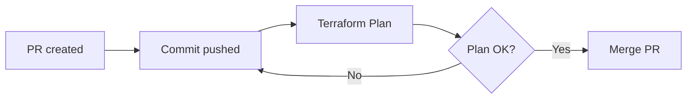

My friends and family love torrenting public domain media from the [Internet Archive](https://archive.org/details/prelinger). I wanted to work on a project that could showcase my skills and deliver them an enterprise-grade media streaming service. So I set out to create the **servarr**, to provide my loved ones with an easy to use service to request and watch openly licensed media.

# Key design decision
I had previously experimented with a Plex Media Server, having installed the app onto a Raspberry Pi. I found it hard to manage the different apps installed on that OS, so I knew I wanted to rebuild this setup using containerised apps instead. I wanted to [KISS](https://en.wikipedia.org/wiki/KISS_principle), so I opted to define my multi-container service using Docker Compose instead of Kubernetes, as the apps were residing on a single host.

# Solution components
## Containers
 The primary app on the servarr is a [Plex Media Server](https://www.plex.tv/personal-media-server/), which organizes and streams the collection of movies and TV shows on the servarr. Then there are a set of containers that are running what's known as the [**arr* apps](https://github.com/Ravencentric/awesome-arr), which are used to request, download, organize, and monitor releases of TV shows and movies. The other containers provide networking, backups, patching, monitoring to the solution:

| Container                                                             |                                Purpose |
| :-------------------------------------------------------------------- | -------------------------------------: |
| [Plex](https://docs.linuxserver.io/images/docker-plex/)               |              Organize and stream media |
| [Overseerr](https://docs.linuxserver.io/images/docker-overseerr/)     | Media discovery and request management |
| [Sonarr](https://docs.linuxserver.io/images/docker-sonarr/)           |                          TV management |
| [Radarr](https://docs.linuxserver.io/images/docker-radarr/)           |                       Movie management |
| [Bazarr](https://docs.linuxserver.io/images/docker-bazarr/)           |                    Subtitle downloader |
| [Prowlarr](https://docs.linuxserver.io/images/docker-prowlarr/)       |                        Torrent indexer |
| [FlareSolverr](https://github.com/FlareSolverr/FlareSolverr)          |  Proxy to bypass Cloudflare protection |
| [qBittorrent](https://docs.linuxserver.io/images/docker-qbittorrent/) |                      BitTorrent client |
| [Maintainerr](https://github.com/jorenn92/Maintainerr)                |              Library management system |
| [Tautulli](https://docs.linuxserver.io/images/docker-tautulli/)       |              Monitor Plex Media Server |
| [Wizarr](https://github.com/wizarrrr/wizarr)                          |         User invitation and management |
| [Cloudflared](https://hub.docker.com/r/cloudflare/cloudflared)        |           Client for Cloudflare Tunnel |
| [Gluetun](https://hub.docker.com/r/qmcgaw/gluetun)                    |                             VPN client |
| [Watchtower](https://hub.docker.com/r/containrrr/watchtower)          |            Automates container updates |
| [Kopia](https://hub.docker.com/r/kopia/kopia)                         |               Backups to cloud storage |
| [Uptime Kuma](https://hub.docker.com/r/elestio/uptime-kuma)           |                        Monitoring tool |

## Networking
When I was renting in Vancouver, I had no access to my landlord's router that was connected to the ISP. I had a [Double NAT](https://kb.netgear.com/30186/What-is-double-NAT-and-why-is-it-bad) network, and could not publish any ports to the internet direcly. This lead me to utilze the [Cloudflare Zero Trust](https://developers.cloudflare.com/cloudflare-one/) suite of products, which could allow me to serve traffic through Cloudflare without access to a publicly routable IP address:
{: width="972" height="589" .w-90 .normal}

The containers all currently reside on the Docker default [bridge network](https://docs.docker.com/engine/network/drivers/bridge/). A Cloudflare Tunnel (cloudflared) container that is deployed on that network, which creates outbound-only connections to Cloudflare's global network. Cloudflared is then configured to allow a public DNS records to reach private services on the bridge network:

```terraform
resource "cloudflare_tunnel_config" "servarr_tunnel" {
  config {
    ingress_rule {
      hostname = "plex.nathanjn.com"
      service  = "http://plex:32400"
    }
  }
}
```

The Plex container is the only one that allows ingress traffic, as I wanted my TV that can reach the host locally, to access content without going over the internet. The Plex container's port is mapped to the host, which allows for inbound private traffic to reach Plex:

```yaml
services:
  plex:
    ports:
      - 32400:32400
```

Most containers use the host's outbound internet connection. For containers that handle torrenting, they are attached to the Gluetun container's network, and use its VPN connection for outbound internet instead: 

```yaml
services:
  sonarr:
    network_mode: service:gluetun
    depends_on:
      - gluetun
```

## Backups
All containers store their configuration data within the */config* directory:

```yaml
services:
  wizarr:
    volumes:
      - /home/nathan/servarr/config/wizarr-config:/data/database
```

This is then mounted to Kopia as a read-only volume:

```yaml
services:
  kopia:
      volumes:
        - /home/nathan/servarr/config:/data:ro
```
A overnight backup of all container config is taken, then stored in Cloudflare R2 (S3-compatible storage), and retained according to a schedule.

## Maintainability
The repo for this project is avaialble on [GitHub](https://github.com/nathanjnorris/servarr). It contains:
  - The Terraform configurations for [Cloudflare](https://github.com/nathanjnorris/servarr/blob/main/cloudflare.tf), and [GitHub](https://github.com/nathanjnorris/servarr/blob/main/github.tf) itself. 
  - [GitHub Actions workflows](https://github.com/nathanjnorris/servarr/tree/main/.github/workflows)
  - The [Docker Compose file](https://github.com/nathanjnorris/servarr/blob/main/docker-compose.yml) that defines the multi-container apps that make up the servarr.
  - A [bash script](https://github.com/nathanjnorris/servarr/blob/main/setup.sh) to configure directories, users, groups and permissions on the host.  

Secrets are stored in the Terraform Cloud workspace, and then configured as repository secrets to be available for the project's CI/CD workflows. There are two workflows, a CI pipeline that triggers a plan-only run in Terraform Cloud, to ensure any changes to cloud services will be successful:


As a part of this project, I contributed some code to [@and-fm's Cloudflare SSH Action](https://github.com/and-fm/cloudflared-ssh-action) which lets you SSH into a server behind a Cloudflare Tunnel and run a command. If a PR is merged, the CD workflow is triggered, and a apply run occurs in Terraform Cloud. Then the workflow [SSH's into the servarr](https://github.com/and-fm/cloudflared-ssh-action) host to deploy the latest changes to the main branch, and then restarts the containers with the latest changes to the Docker Compose file:


## Monitoring
[Uptime Kuma](https://uptime.kuma.pet/) is a monitoring tool, which I use to monitor for HTTP(S) keyword and container states. 
Uptime Kuma is integrated with Pushbullet, and whenever a service is unavailable after two 60 second intervals, a notification is sent to my phone:

{: width="972" height="589" .w-75 .normal}


I also use Uptime Kuma to publish a [service status dashboard](https://status.nathanjn.com/status/servarr) that is available for users:
 
{: width="972" height="589" .w-90 .normal}
 
With a [Plex Pass](https://www.plex.tv/plex-pass/), you can use the [Plex Dash](https://play.google.com/store/apps/details?id=tv.plex.labs.dash&hl=en_NZ) app to monitor host metrics (bandwith, processor and memory) and any current user activity.

## Operations
The system is plug and play - all you need to do is provide the servarr with an ethernet connection and power. On boot, [fstab](https://www.redhat.com/en/blog/etc-fstab) is configured to mount the attached storage. Docker starts by default on Ubuntu, and all the containers are configured to always restart unless manually stopped:
```yaml
services:
  maintainerr:
    restart: always
```

If and when a container exits unexpectedly and cannot restart itself, you can SSH into the servarr from a web browser and run a *docker compose up -d* command to bring the container back to the correct state:


SSH access via Cloudflare is restricted to either my Google identity, or an identity created for GitHub Actions. 
An attacker would need to compromise either of these identities, and the private key of a user on the servarr, in order to gain unauthorized access.

Sometimes I need to message all users if there's going to be an extended planned outage period (e.g. when I move house). Tautulli can be integrated with SMTP relays, and I have integrated with SendGrid. This allows me to send an email to the addresses associated with my users' Plex accounts.

As the mounted disk has only 8TB of space, I use the Maintainerr container to automatically cleanup media that has been watched (or ignored) by the user who requested it. This leaves free space available for new media requests, but a smaller library that is immediately available for streaming.

## Security
### Zero Trust
Apart from the few of the apps where public access is required, I use Cloudflare to implement Zero Trust controls. In the following example, only two identities can reach Sonarr:
1. Uptime Kuma - as this service cannot interactively sign in, it needs to present a Client ID + Secret in the header of its requests in order to access Sonarr. 
2. My Google account - whenever I attempt to reach Sonarr, I am redirected to an IdP for authentication, and I have established SSO integration with Google. Within my GCP project, there is an [OAuth 2.0 client setup](https://developers.cloudflare.com/cloudflare-one/identity/idp-integration/google/) where only my account is able to access the app. Once I get a token from my IdP, Cloudflare then checks its configuration to ensure I am authorized to reach it.
 
```terraform
resource "cloudflare_access_application" "sonarr_nathanjn_com" {
  auto_redirect_to_identity = true
  allowed_idps              = ["97ed69f2-279d-4cef-bc29-65b6f7e915bf"]
}

resource "cloudflare_access_policy" "service_sonarr" {
  name           = "Service auth"
  decision       = "non_identity"
  include {
    service_token = [cloudflare_access_service_token.uptime_kuma.id]
  }
}

resource "cloudflare_access_policy" "user_sonarr" {
  name           = "User auth"
  decision       = "allow"
  include {
    email = ["nathan.james.norris@gmail.com"]
  }
}
```
### Web application security
Any inbound traffic to the servarr is proxied by Cloudflare, and I use it to enforce certain security configurations such as:
- Protecting my domain with DNSSEC.
- Presenting a valid SSL certificate for all apps, without having a certficate installed on them.
- Uplifting all HTTP requests to HTTPS, and enforce at least TLS 1.2.
- Using the WAF, DDoS, and bot protections available in the Free plan.

### Updates
I've installed Ubuntu Pro (22.04 LTS) on the servarr, and enabled Extended Security Maintainance (ESM).
A nightly cronjob then applies application security updates and kernel livepatching for high and critical CVEs.

[Watchtower](https://containrrr.dev/watchtower/) is used to pull down the latest image of the containers I run from their public registries, gracefully shut down containers during a change window, and restart them.

## Pricing
### CapEx

| Name                                                 | Price      |                                                                Link |
| :--------------------------------------------------- | :--------- | ------------------------------------------------------------------: |
| Beelink S12 Mini Pro (N100 CPU, 16GB RAM, 500GB SSD) | CA$235     | [AliExpress](https://www.aliexpress.com/item/1005006448497188.html) |
| Seagate IronWolf 8TB NAS HDD                         | CA$240     |                       [Amazon](https://www.amazon.ca/dp/B084ZV4DXB) |
| External HDD enclosure                               | CA$27      |                       [Amazon](https://www.amazon.ca/dp/B0CCNK72YP) |
| Lifetime Plex Pass                                   | CA$159     |                              [Plex](https://www.plex.tv/plex-pass/) |
| **Total**                                            | **CA$661** |                                                                     |

The Beelink S12 Mini Pro comes with an Intel N100 processor that supports Quick Sync for transcoding media, while remaining power effecient with an average  draw of 6 watts. Purchasing the Plex Pass enables transcoding using Quick Sync. This feature alone is worthwhile paying for, as the Plex Media Server will be able to transcode media to the formats supported and bandwidth available to your clients. The HDD that I used is NAS-optimized, and the external enclosure supports transfer speeds up to 6 Gbps. The compute and storage for this project are cost effective and perform well, with my home internet speed being the only bottleneck I've encountered. 

### OpEx
Apart from electricity and home internet, the only operational cost for this project is renewing my domain and a VPN that supports port forwarding:

| Name                 | Price (yearly) |
| :------------------- | :------------- |
| Cloudflare Registrar | CA$15          |
| AirVPN               | CA$86          |
| **Total**            | **CA$101**     |

My usage of the Github, Terraform Cloud, Cloudflare, SendGrid, and Pushbullet are all within the limits of their free plans. 

### ROI
As of the time of writing, a Netflix Premium Plan costs CA$23/mth. It should take just over 3 years for this project to break-even, when compared to a single household with a Netflix subscription. Theoretically, that break-even point could occur sooner if more of my users cancel their streaming services and only use the servarr.

## Further work

I have a few improvements in the roadmap that I'd like to work on when I have some spare time:

 - **Monitoring**
   - **Problem:** Uptime Kuma is on the same host as the apps. Sometimes power is lost to the host, and I don't receive any alerts. Uptime Kuma also doesn't monitor host metrics, so I don't have any alerts configured when avaialble storage is low or the CPU is maxed-out.
   - **Solution:** I'd like to deploy a Kubernetes cluster with Prometheus and Grafana on GCP. I can use Prometheus to collect metrics from the servarr host  and my existing Uptime Kuma configuration, then use Grafana for building out dashboards and alerts.
 - **Networking**
   - **Problem:** Currently, all of the containers reside on the same default network, and all containers can reach each other. 
   - **Solution:** Docker Compose allows you to define your own networks, and specify the network(s) that containers are connected to. I'd like to build in network segmentation into my configuration, and create smaller, manageable networks based on security risk.
